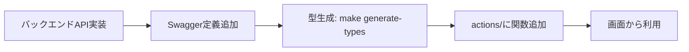

# 顧客管理システム

顧客情報を管理するためのWebアプリケーション

## 📋 概要

このプロジェクトは、顧客情報の管理、検索、分析を行うためのWebアプリケーションです。フロントエンドはNext.js、バックエンドはRuby on Railsで構築されています。

## 🏗️ 技術スタック

### フロントエンド
- **Next.js** - Reactフレームワーク
- **TypeScript** - 型安全なJavaScript
- **Tailwind CSS** - スタイリング

### バックエンド
- **Ruby on Rails** - Webアプリケーションフレームワーク
- **PostgreSQL** - データベース
- **Ruby** - プログラミング言語

### インフラ
- **Docker** - コンテナ化
- **Docker Compose** - マルチコンテナ管理
- **Make** - タスク自動化

## 🚀 セットアップ

### 前提条件
- Docker
- Docker Compose
- Make
- Node.js (v18以上) - フロントエンド開発用
- pnpm - パッケージマネージャー

### クイックスタート

```bash
# プロジェクトのルートディレクトリで実行

# 1. フロントエンドの依存関係をインストール
cd frontend && pnpm install
cd ..

# 2. バックエンドとデータベースを起動
make backend

# 3. 別のターミナルでフロントエンドを起動
make frontend
```

### アクセス方法
- **フロントエンド**: http://localhost:3000
- **バックエンド**: http://localhost:3001
- **データベース**: localhost:5432

## 🛠️ Makefileコマンド

### 基本的な操作
```bash
make backend     # バックエンド（Rails API + PostgreSQL）を起動
make frontend    # フロントエンド（Next.js）をローカルで起動
make stop        # 全てのサービスを停止
make down        # 全てのサービスを停止（stopのエイリアス）
make logs        # バックエンドのログを表示
make clean       # コンテナとボリュームを完全削除
make status      # サービス状況を確認
```

### コード品質
```bash
make lint          # コード品質チェック（RuboCop + ESLint）
make fix           # コード自動修正
make test          # テスト実行
make generate-types # OpenAPIスキーマからTypeScript型を自動生成
```

## 📁 プロジェクト構造

```
cms/
├── frontend/          # Next.jsフロントエンド
├── backend/           # Railsバックエンド
├── .github/           # GitHub設定ファイル
├── docker-compose.yml # Docker Compose設定
├── Makefile          # タスク自動化
└── README.md         # プロジェクトドキュメント
```

## 🧪 テスト

### フロントエンド
```bash
cd frontend
pnpm test
```

### バックエンド
```bash
make test
```

## 📝 開発ガイドライン

### API開発フロー

新しいAPIを追加する際は、以下の手順に従ってください。

**詳細は [API開発ガイド](./docs/api-development-guide.md) を参照してください。**

#### クイックリファレンス

```bash
# 1. バックエンドAPI実装
cd backend
rails g controller Api::V1::ResourceName
# コントローラー実装 + ルート追加

# 2. Swagger定義追加
# backend/swagger/v1/schemas/models.yaml にモデル追加
# backend/swagger/v1/paths/resources.yaml にエンドポイント追加
# backend/swagger/v1/openapi.yaml に参照追加

# 3. TypeScript型生成
make generate-types

# 4. フロントエンドAPI関数作成
# frontend/src/lib/actions/resource.ts に関数追加

# 5. 画面から利用
import { getResource } from '@/lib/actions';
```

### 型システムとAPI層の構成

#### 型定義の構成
```
frontend/src/types/
├── api/
│   └── generated.ts      # OpenAPI自動生成（手動編集禁止）
├── models/
│   ├── form.ts          # フォーム専用型
│   └── ui.ts            # UI状態管理型
├── utils/
│   └── common.ts        # 共通ユーティリティ型
└── index.ts             # 統一エクスポート
```

#### API層の構成
```
frontend/src/lib/
├── api-client.ts        # 共通fetchラッパー（認証ヘッダー管理）
└── actions/
    ├── auth.ts         # 認証関連API
    ├── profile.ts      # プロフィール関連API
    ├── home.ts         # ホーム関連API
    └── index.ts        # 統一エクスポート
```

#### API開発の流れ


**重要なポイント:**
- `types/api/generated.ts` は自動生成 → 直接編集禁止
- API仕様変更時は必ず `make generate-types` を実行
- すべての型は `@/types` からimport
- API関数は `@/lib/actions` からimport
- 認証が必要なAPIは `apiFetch`、不要なAPIは `publicFetch` を使用

### コミットメッセージ
- 日本語で記述
- 変更内容を簡潔に説明
- 必要に応じてIssue番号を記載

### プルリクエスト
- テンプレートを使用して作成
- 適切なレビュアーを指定
- テストが通ることを確認
- API変更時は型生成を忘れずに実行

## 🔧 環境変数

### フロントエンド (.env.local)
```
NEXT_PUBLIC_API_URL=http://localhost:3001
```

### バックエンド (docker-compose.ymlで管理)
```yaml
environment:
  DATABASE_URL: postgresql://cms_user:cms_password@db:5432/cms_development
  RAILS_ENV: development
```

## 🐳 Docker構成

### サービス構成
- **db**: PostgreSQL 15
- **backend**: Ruby on Rails API

### フロントエンド
- 開発時はローカルで実行（ホットリロードのため）
- 本番時は静的ファイルとしてデプロイ

## 📚 ドキュメント

- [API開発ガイド](./docs/api-development-guide.md) - 新しいAPI機能を追加する際の手順書
- [フロントエンドREADME](./frontend/README.md)
- [バックエンドREADME](./backend/README.md)

## 🤝 コントリビューション

1. このリポジトリをフォーク
2. 機能ブランチを作成 (`git checkout -b feature/amazing-feature`)
3. 変更をコミット (`git commit -m 'Add some amazing feature'`)
4. ブランチにプッシュ (`git push origin feature/amazing-feature`)
5. プルリクエストを作成

## 📄 ライセンス

このプロジェクトはMITライセンスの下で公開されています。

## 👥 チーム

- 開発者: [あなたの名前]
- プロジェクトマネージャー: [PMの名前]

## 📞 サポート

質問や問題がある場合は、Issueを作成するか、チームに直接連絡してください。