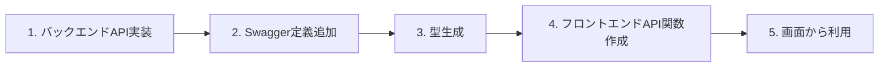

# API開発ガイド

このドキュメントでは、バックエンドのAPI追加からフロントエンドでの利用までの一連の流れを説明します。

## 📋 開発フロー概要



---

## 1. バックエンドAPI実装

### 1-1. モデル作成（必要な場合）

```bash
cd backend
rails generate model ModelName field1:type field2:type
rails db:migrate
```

### 1-2. コントローラー作成

```bash
rails generate controller Api::V1::ModelNames
```

**例：`backend/app/controllers/api/v1/user_profiles_controller.rb`**

```ruby
module Api
  module V1
    class UserProfilesController < ApplicationController
      before_action :authenticate_user!

      # GET /api/v1/user_profile
      def show
        profile = current_user.user_profile
        render json: profile
      end

      # POST /api/v1/user_profile
      def create
        profile = current_user.build_user_profile(user_profile_params)
        if profile.save
          render json: profile, status: :created
        else
          render json: { errors: profile.errors.full_messages }, status: :unprocessable_entity
        end
      end

      private

      def user_profile_params
        params.require(:user_profile).permit(:last_name, :first_name, ...)
      end
    end
  end
end
```

### 1-3. ルート追加

**`backend/config/routes.rb`**

```ruby
namespace :api do
  namespace :v1 do
    resource :user_profile, only: [:show, :create, :update]
  end
end
```

---

## 2. Swagger定義追加

### 2-1. スキーマ定義（必要な場合）

**`backend/swagger/v1/schemas/models.yaml`**

新しいモデルを追加する場合：

```yaml
UserProfile:
  type: object
  required:
    - id
    - user_id
    - last_name
    - first_name
  properties:
    id:
      type: integer
      example: 1
    user_id:
      type: integer
      example: 1
    last_name:
      type: string
      example: "山田"
    created_at:
      type: string
      format: date-time
```

### 2-2. リクエスト/レスポンス定義

**`backend/swagger/v1/schemas/requests.yaml`**（リクエスト）

```yaml
UserProfileRequest:
  type: object
  required:
    - user_profile
  properties:
    user_profile:
      type: object
      required:
        - last_name
        - first_name
      properties:
        last_name:
          type: string
        first_name:
          type: string
```

**`backend/swagger/v1/schemas/responses.yaml`**（レスポンス、必要なら）

### 2-3. エンドポイント定義

新しいファイルを作成、または既存ファイルに追加：

**`backend/swagger/v1/paths/profiles.yaml`**

```yaml
/api/v1/user_profile:
  get:
    summary: プロフィール取得
    tags:
      - UserProfile
    responses:
      '200':
        description: プロフィール情報
        content:
          application/json:
            schema:
              $ref: '../schemas/models.yaml#/UserProfile'
      '404':
        description: プロフィールが見つかりません

  post:
    summary: プロフィール作成
    tags:
      - UserProfile
    requestBody:
      content:
        application/json:
          schema:
            $ref: '../schemas/requests.yaml#/UserProfileRequest'
    responses:
      '201':
        description: プロフィール作成成功
        content:
          application/json:
            schema:
              $ref: '../schemas/models.yaml#/UserProfile'
      '422':
        description: バリデーションエラー
        content:
          application/json:
            schema:
              $ref: '../schemas/responses.yaml#/ErrorResponse'
```

### 2-4. メインファイルに参照追加

**`backend/swagger/v1/openapi.yaml`**

```yaml
paths:
  /api/v1/user_profile:
    $ref: './paths/profiles.yaml#/~1api~1v1~1user_profile'

components:
  schemas:
    UserProfile:
      $ref: './schemas/models.yaml#/UserProfile'
    UserProfileRequest:
      $ref: './schemas/requests.yaml#/UserProfileRequest'
```

**注意:** パス参照は`~1`でスラッシュをエスケープ（JSON Pointer形式）

---

## 3. TypeScript型生成

### 3-1. 型生成コマンド実行

```bash
# フロントエンドのルートディレクトリで
make generate-types

# または
cd frontend
pnpm run generate:types
```

これにより、`frontend/src/types/api/generated.ts`が自動生成されます。

### 3-2. 生成された型を確認

```typescript
// frontend/src/types/api/generated.ts に自動追加される
export type UserProfile = components["schemas"]["UserProfile"];
export type UserProfileRequest = components["schemas"]["UserProfileRequest"];
```

---

## 4. フロントエンドAPI関数作成

### 4-1. 適切なactionsファイルに追加

新しい機能の場合は新規ファイル作成、既存機能なら既存ファイルに追加。

**`frontend/src/lib/actions/profile.ts`**

```typescript
import { apiFetch } from '../api-client';
import type { UserProfile, UserProfileRequest } from '@/types';

/**
 * プロフィール取得
 */
export async function getUserProfile(): Promise<UserProfile> {
  return apiFetch<UserProfile>('/api/v1/user_profile');
}

/**
 * プロフィール作成
 */
export async function createUserProfile(
  profileData: UserProfileRequest
): Promise<UserProfile> {
  return apiFetch<UserProfile>('/api/v1/user_profile', {
    method: 'POST',
    body: JSON.stringify(profileData),
  });
}
```

### 4-2. index.tsでエクスポート

**`frontend/src/lib/actions/index.ts`**

```typescript
export * from './auth';
export * from './profile';  // 新規追加の場合はここに追加
export * from './home';
```

---

## 5. 画面から利用

### 5-1. API関数をインポート

```typescript
import { getUserProfile, createUserProfile } from '@/lib/actions';
import type { UserProfile } from '@/types';
```

### 5-2. コンポーネントで使用

```typescript
export default function ProfilePage() {
  const [profile, setProfile] = useState<UserProfile | null>(null);

  useEffect(() => {
    const loadProfile = async () => {
      try {
        const data = await getUserProfile();
        setProfile(data);
      } catch (error) {
        console.error('Failed to load profile:', error);
      }
    };
    loadProfile();
  }, []);

  const handleSubmit = async (formData: UserProfileRequest) => {
    try {
      const newProfile = await createUserProfile(formData);
      setProfile(newProfile);
    } catch (error) {
      console.error('Failed to create profile:', error);
    }
  };

  // ...
}
```

---

## 📁 ファイル構成

### バックエンド

```
backend/
├── app/
│   ├── controllers/api/v1/
│   │   └── user_profiles_controller.rb
│   └── models/
│       └── user_profile.rb
├── config/
│   └── routes.rb
└── swagger/v1/
    ├── openapi.yaml              # メインファイル（参照のみ）
    ├── schemas/
    │   ├── models.yaml           # モデル定義
    │   ├── requests.yaml         # リクエスト定義
    │   └── responses.yaml        # レスポンス定義
    └── paths/
        ├── auth.yaml             # 認証エンドポイント
        ├── profiles.yaml         # プロフィールエンドポイント
        └── home.yaml             # ホームエンドポイント
```

### フロントエンド

```
frontend/src/
├── lib/
│   ├── api-client.ts            # 共通fetchラッパー
│   └── actions/
│       ├── auth.ts              # 認証API
│       ├── profile.ts           # プロフィールAPI
│       ├── home.ts              # ホームAPI
│       └── index.ts             # 統一エクスポート
└── types/
    ├── api/
    │   └── generated.ts         # 自動生成（編集禁止）
    ├── models/
    │   ├── form.ts              # フォーム型
    │   └── ui.ts                # UI状態型
    ├── utils/
    │   └── common.ts            # 共通型
    └── index.ts                 # 統一エクスポート
```

---

## 🔧 Tips

### 認証が必要なAPIの場合

- `apiFetch`を使用（自動でAuthorizationヘッダー付与）

```typescript
export async function getProtectedData() {
  return apiFetch<DataType>('/api/v1/protected');
}
```

### 認証不要の公開APIの場合

- `publicFetch`を使用

```typescript
export async function getPublicData() {
  return publicFetch<DataType>('/api/v1/public');
}
```

### 型エイリアスの追加

自動生成後、使いやすい型エイリアスを追加する場合は`generated.ts`の末尾に手動追加：

```typescript
// frontend/src/types/api/generated.ts
export type User = components["schemas"]["User"];
export type UserProfile = components["schemas"]["UserProfile"];
```

**注意:** 次回の型生成時に上書きされる可能性があるため、重要な型は`types/models/`や`types/utils/`に別途定義することを推奨。

---

## ✅ チェックリスト

新しいAPI機能を追加する際は、以下を確認：

- [ ] バックエンドのコントローラー実装完了
- [ ] ルート設定完了
- [ ] Swagger定義追加（schemas + paths）
- [ ] `openapi.yaml`に参照追加
- [ ] 型生成コマンド実行（`make generate-types`）
- [ ] フロントエンドのactions関数作成
- [ ] actions/index.tsにエクスポート追加
- [ ] 画面から正しく呼び出せることを確認
- [ ] エラーハンドリング実装

---

## 🐛 トラブルシューティング

### 型が生成されない

1. Swagger YAMLの構文エラーを確認
2. `openapi.yaml`に`$ref`が正しく追加されているか確認
3. パス参照の`~1`エスケープが正しいか確認

### TypeScriptエラーが出る

1. エディタのTypeScriptサーバーを再起動（VSCode: `Cmd+Shift+P` > "TypeScript: Restart TS Server"）
2. `pnpm run build`でビルドエラーを確認

### APIが404エラー

1. バックエンドのルート設定確認（`rails routes | grep api`）
2. エンドポイントのパスが正しいか確認
3. バックエンドが起動しているか確認（`make backend`）
